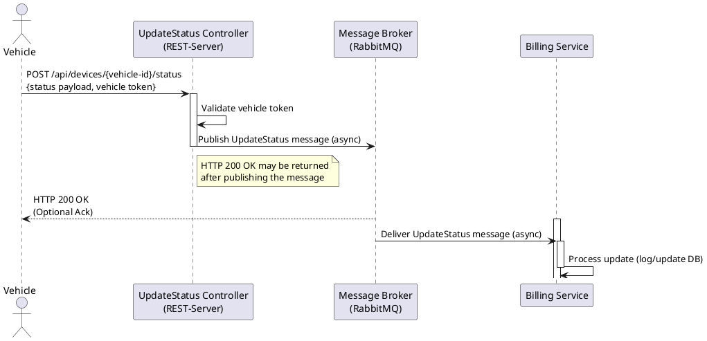
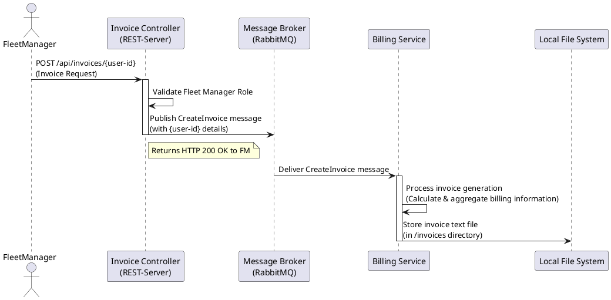

```plantuml
@startuml
actor Vehicle

participant "UpdateStatus Controller\n(REST-Server)" as RESTController
participant RabbitMQ as "Message Broker\n(RabbitMQ)"
participant "Billing Service" as BillingService

Vehicle -> RESTController: POST /api/devices/{vehicle-id}/status\n{status payload, vehicle token}
activate RESTController
RESTController -> RESTController: Validate vehicle token

RESTController -> RabbitMQ: Publish UpdateStatus message (async)
deactivate RESTController
note right of RESTController: HTTP 200 OK may be returned\nafter publishing the message

RabbitMQ --> Vehicle: HTTP 200 OK\n(Optional Ack)
activate BillingService
RabbitMQ -> BillingService: Deliver UpdateStatus message (async)
activate BillingService
BillingService -> BillingService: Process update (log/update DB)
deactivate BillingService
@enduml
```

```plantuml
@startuml
actor FleetManager as FM

participant "Invoice Controller\n(REST-Server)" as InvoiceController
participant RabbitMQ as "Message Broker\n(RabbitMQ)"
participant "Billing Service" as BillingService

FM -> InvoiceController: POST /api/invoices/{user-id}\n(Invoice Request)
activate InvoiceController
InvoiceController -> InvoiceController: Validate Fleet Manager Role
InvoiceController -> RabbitMQ: Publish CreateInvoice message\n(with {user-id} details)
deactivate InvoiceController
note right of InvoiceController: Returns HTTP 200 OK to FM

RabbitMQ -> BillingService: Deliver CreateInvoice message
activate BillingService
BillingService -> BillingService: Process invoice generation\n(Calculate & aggregate billing information)
BillingService -> "Local File System": Store invoice text file\n(in /invoices directory)
deactivate BillingService
@enduml
```
