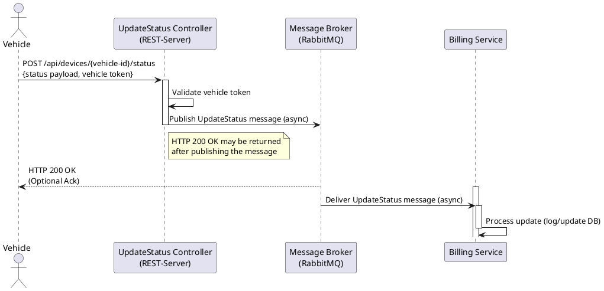

```plantuml
@startuml
actor Vehicle

participant "UpdateStatus Controller\n(REST-Server)" as RESTController
participant RabbitMQ as "Message Broker\n(RabbitMQ)"
participant "Billing Service" as BillingService

Vehicle -> RESTController: POST /api/devices/{vehicle-id}/status\n{status payload, vehicle token}
activate RESTController
RESTController -> RESTController: Validate vehicle token

RESTController -> RabbitMQ: Publish UpdateStatus message (async)
deactivate RESTController
note right of RESTController: HTTP 200 OK may be returned\nafter publishing the message

RabbitMQ --> Vehicle: HTTP 200 OK\n(Optional Ack)
activate BillingService
RabbitMQ -> BillingService: Deliver UpdateStatus message (async)
activate BillingService
BillingService -> BillingService: Process update (log/update DB)
deactivate BillingService
@enduml
```
